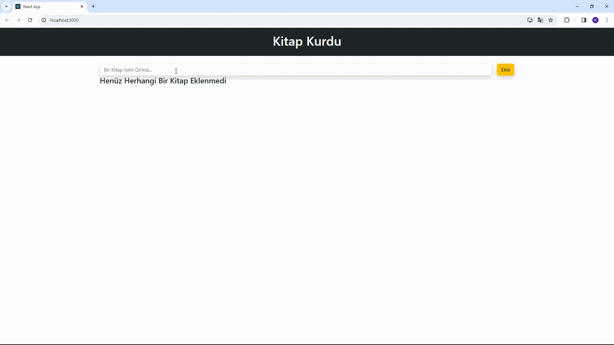

<h1>Book-Project</h1>

Bu proje kitap eklemek, düzenlemek, silmek ve okuma durumunu güncellemek gibi temel işlevlere sahip bir kitap takip uygulamasını oluşturuyor. 

Özellikler

-Kitap Ekleme:Kullanıcı, bir kitap ismi girdikten sonra "Ekle" butonuna tıklayarak yeni bir kitap ekleyebilir.
Eğer kitap ismi girilmezse, kullanıcıya bir uyarı (toast) gösterilir.

-Kitap Listesi:Eklenen kitaplar, kartlar halinde ekranda gösterilir.
Her kitap kartının üzerinde kitap ismi, eklenme tarihi ve kitabın okunma durumu bulunmaktadır.

-Kitap Silme:Her kitap kartının üzerinde bir "Sil" butonu bulunmaktadır.
Bu butona tıklandığında, kullanıcıya silme işlemi onayı almak için bir modal gösterilir.Silme işlemi gerçekleştikten sonra kullanıcıya bir uyarı (toast) gösterilir.

-Kitap Düzenleme:Her kitap kartının üzerinde bir "Düzenle" butonu bulunmaktadır.Bu butona tıklandığında, kitabın bilgilerini düzenlemek için bir modal gösterilir.Düzenleme işlemi gerçekleştikten sonra kullanıcıya bir uyarı (toast) gösterilir.

-Kitap Okuma Durumu Güncelleme:Her kitap kartının üzerinde bir "Okundu/Okunmadı" butonu bulunmaktadır.Bu butona tıklandığında, kitabın okuma durumu tersine çevrilir.

